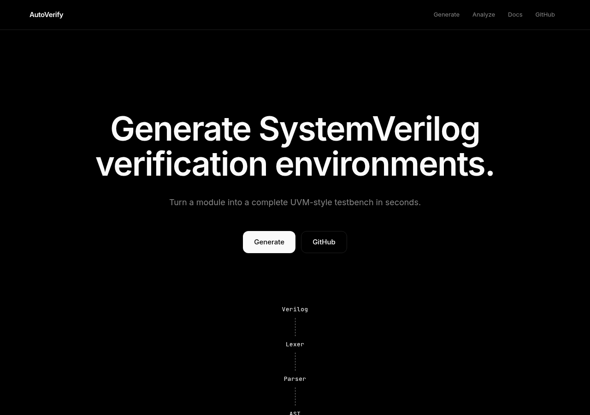
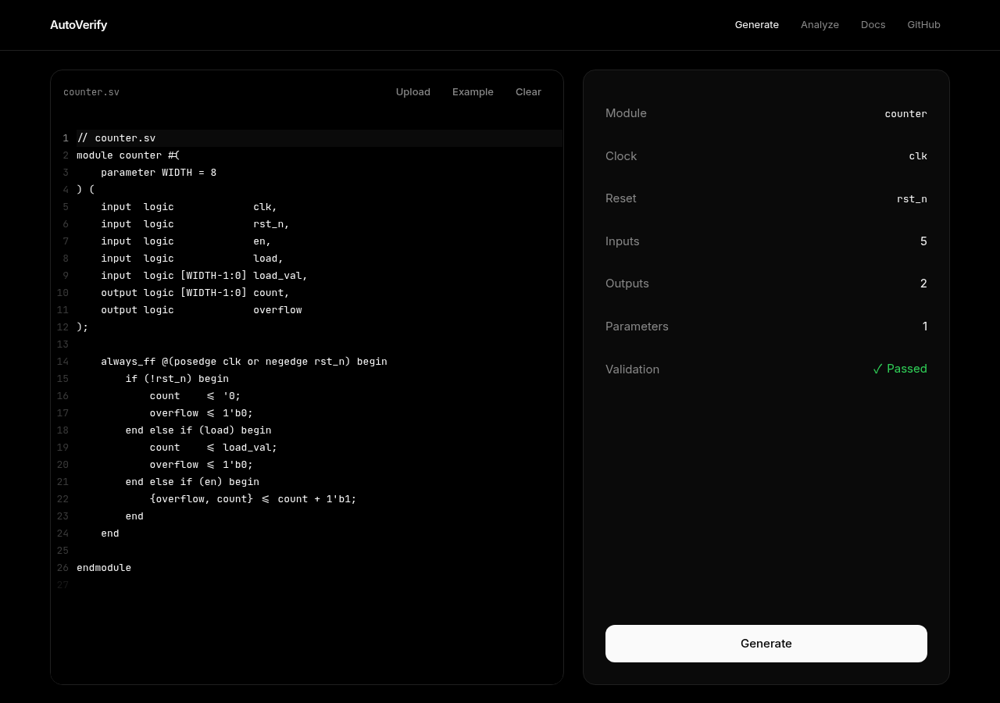
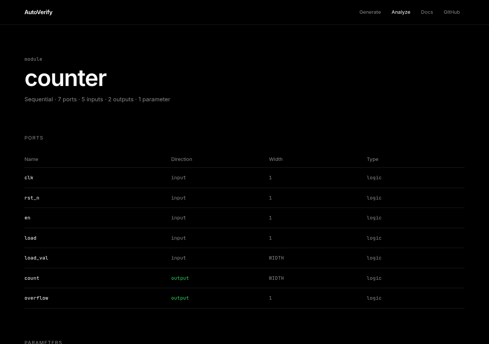
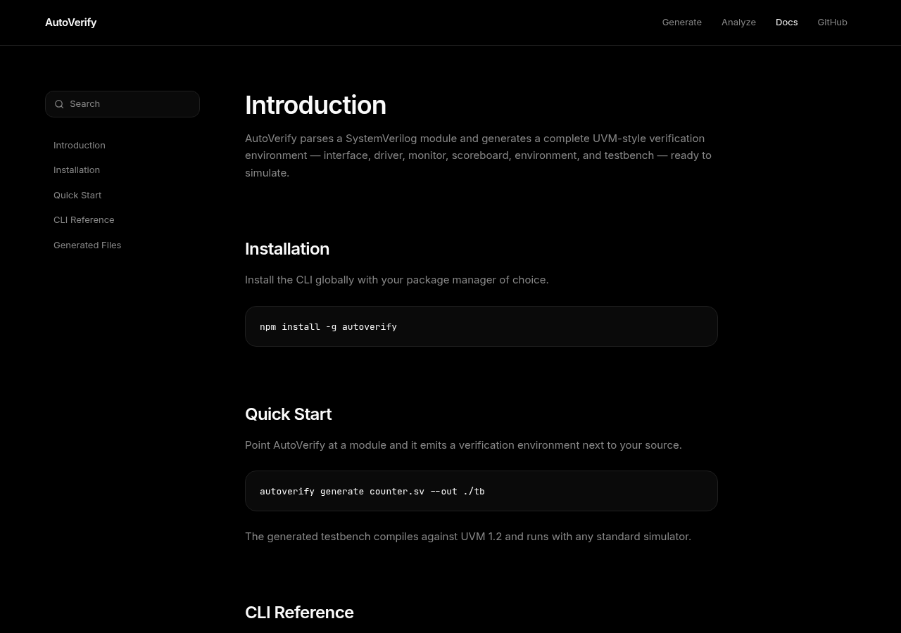
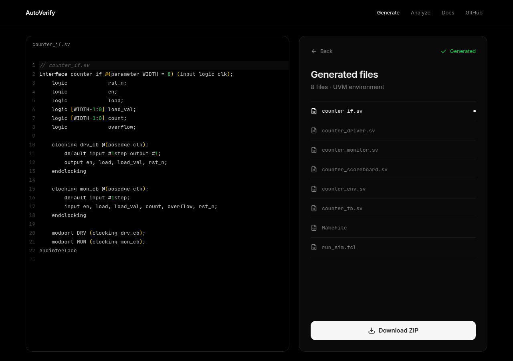

# AutoVerify

**AutoVerify** turns a SystemVerilog module into a complete, UVM-style
verification testbench - automatically. It's an educational project built
around a course on scripting languages and verification methodology, and it
demonstrates how Perl and Python scripting can automate the repetitive,
error-prone parts of standing up verification infrastructure.

This is not an AI tool, and it doesn't replace a verification engineer's
judgment. It automates the mechanical part of the job - reading a module's
port list and generating the matching testbench scaffolding - the same way
a good Makefile or a well-written script automates any other repeatable
engineering task.

## Motivation

Every new RTL module in a verification flow needs the same supporting
files: a testbench shell, an interface, stimulus/response handling wired to
the right ports, and a driver/monitor pair that respects the module's
clock and reset. Writing this by hand for every module is repetitive and a
common source of copy-paste bugs. AutoVerify was built to explore how far
classic text-processing scripting - Perl for the parsing and generation
core, Python for a service layer around it - can go in automating that
setup, as a hands-on complement to coursework on verification methodology.

## Features

- **Parses** Verilog/SystemVerilog ANSI-style module headers into a
  structured representation (module name, parameters, ports).
- **Validates** the parsed module and surfaces diagnostics (errors and
  warnings) before generation.
- **Classifies ports** automatically - clock/reset detection, and a
  stimulus/response/inout split for driver and monitor generation.
- **Generates** a complete testbench file set from customizable templates.
- **Web interface** to paste or upload RTL, inspect analysis results, and
  download the generated testbench as a zip.
- **Simulator command generation** for Questa, VCS, and Xcelium.

## Architecture

```
Frontend (Next.js)  →  Backend API (FastAPI)  →  Perl bridge  →  AutoVerify Core (Perl)
```

The frontend is a thin client over the backend's HTTP API. The backend is a
pure orchestration layer - request validation, job/zip management, and
error mapping - with no parsing logic of its own; it calls the original
Perl core as a subprocess through a small JSON-in/JSON-out bridge script.

See [`docs/architecture.md`](docs/architecture.md) for the full breakdown of
each layer and its responsibilities.

## Repository structure

```
AutoVerify/
├── README.md
├── LICENSE
├── .gitignore
├── docs/
│   ├── architecture.md
│   ├── deployment.md
│   └── screenshots/
├── frontend/          # Next.js UI
└── backend/           # Perl core + FastAPI service
    ├── lib/AutoVerify/    # Parsing, validation, port classification, codegen
    ├── bin/                # CLI + Perl↔JSON bridge script
    ├── backend/app/        # FastAPI routes, models, service layer
    └── docs/               # Backend-specific architecture/deployment notes
```

## Installation

```bash
git clone https://github.com/<your-username>/AutoVerify.git
cd AutoVerify

# Backend
cd backend/backend
pip install -r requirements.txt
cd ../..

# Frontend
cd frontend
pnpm install   # or npm install
cd ..
```

Perl core dependencies ship with any modern Perl install (only
`JSON::PP`, part of Perl core, is required) - no extra install needed.

## Running locally

```bash
# Terminal 1 - backend (from backend/backend)
uvicorn app.main:app --reload --port 8000

# Terminal 2 - frontend (from frontend)
cp .env.local.example .env.local   # NEXT_PUBLIC_API_URL=http://localhost:8000
pnpm dev
```

Open `http://localhost:3000` for the app and `http://localhost:8000/docs`
for the backend's interactive OpenAPI documentation.

## Deployment

AutoVerify deploys as two independent services: **frontend on Vercel** and
**backend on Railway** (Docker-based). Full step-by-step instructions,
including environment variables and CORS configuration, are in
[`docs/deployment.md`](docs/deployment.md).

## Tech stack

| Layer | Technology |
|---|---|
| Frontend | Next.js, React, TypeScript, Tailwind CSS |
| Backend API | FastAPI, Pydantic, Uvicorn |
| Verification core | Perl (parsing, validation, codegen) |
| Testing | pytest (backend), Perl test suite (`t/*.t`) |
| Deployment | Vercel (frontend), Railway / Docker (backend) |

## Screenshots

| Landing | Generate |
|---|---|
|  |  |

| Analyze | Docs |
|---|---|
|  |  |



## Author

Built as a university engineering project exploring scripting-based
automation for SystemVerilog verification workflows, developed for a
Scripting Languages and Verification course.

## License

Released under the [MIT License](LICENSE).
